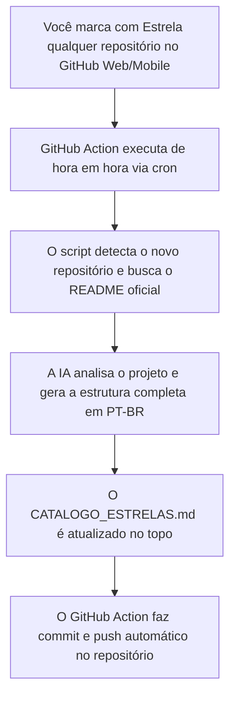

# 🌟 Auto GitHub Star Analyzer & Catalog

Este repositório monitora automaticamente todos os repositórios que você marca com estrela (**Star**) no seu perfil do GitHub e gera um dossiê técnico minucioso com Inteligência Artificial, **sem que você precise fazer absolutamente nada manual**.

---

## ⚙️ Como Funciona o Fluxo 100% Automático

---

## 🎯 Estrutura Gerada para Cada Repositório

Para cada novo projeto estrelado, a automação insere:
* 🎯 **O que é e para que serve**
* 💡 **Casos de uso reais no dia a dia**
* 🚀 **Como usar na prática com comandos prontos (Docker, pip, npm, CLI)**
* ⚡ **Dica Pro de produtividade**

---

## 🚀 Como Ativar em 2 Minutos na sua Conta GitHub

1. **Crie um novo repositório no seu GitHub** (ex: `meus-stars` ou utilize seu repositório de perfil `Jerixco`).
2. **Suba esta pasta completa** para o repositório.
3. *(Opcional, recomendado para análises mais profundas)*: Vá em **Settings** > **Secrets and variables** > **Actions** e adicione:
   * `GEMINI_API_KEY`: Sua chave gratuita da API do Google AI Studio (ou `OPENAI_API_KEY`).
   *(Se não adicionar nenhuma chave, a automação usará o gerador heurístico automático sem quebrar!)*
4. Pronto! A partir de agora, sempre que você clicar em ⭐ em qualquer repositório, o seu catálogo será atualizado sozinho!
